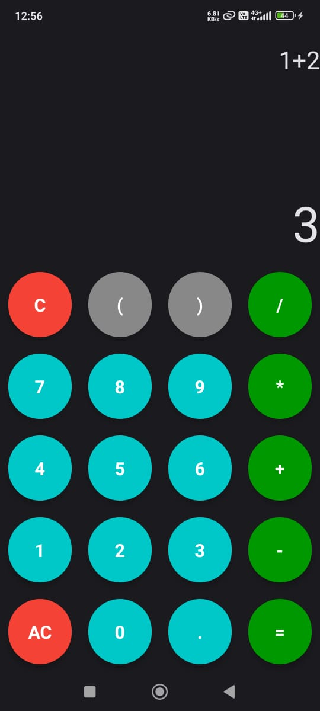

# Calculator App

A basic calculator app built with Jetpack Compose and Kotlin.  
Supports simple arithmetic operations with live evaluation of expressions.

## Features
- Addition, subtraction, multiplication, division  
- Parentheses and decimal support  
- Clear (C) and All Clear (AC) buttons  
- Real-time result display using Rhino JS engine  

## How to Run
Open the project in Android Studio and run on a device or emulator (min SDK 24).
